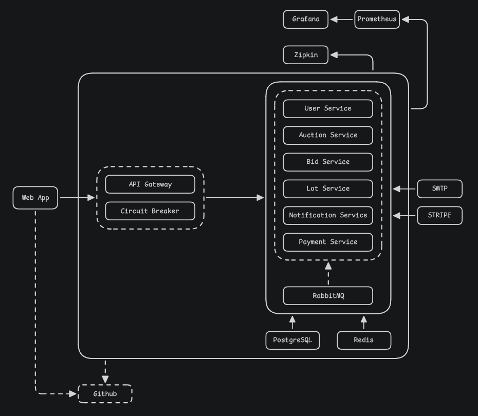
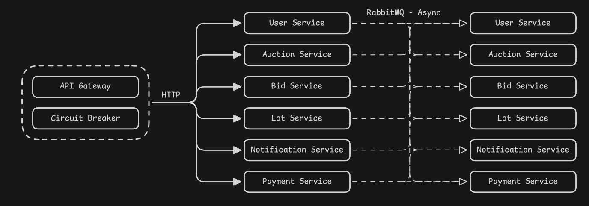
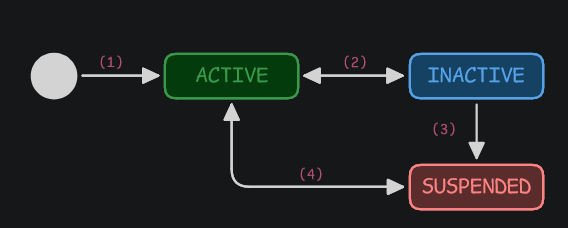
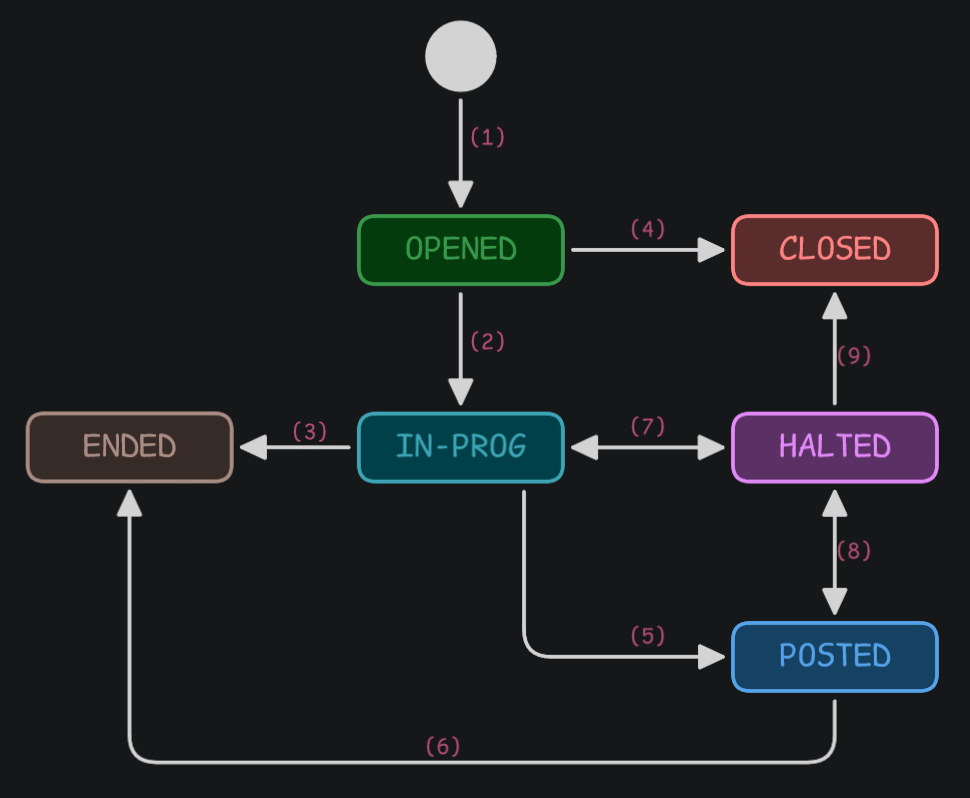
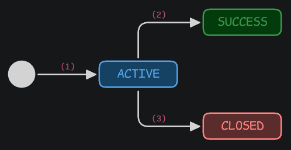
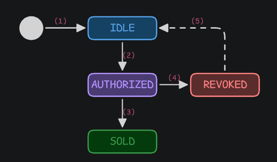
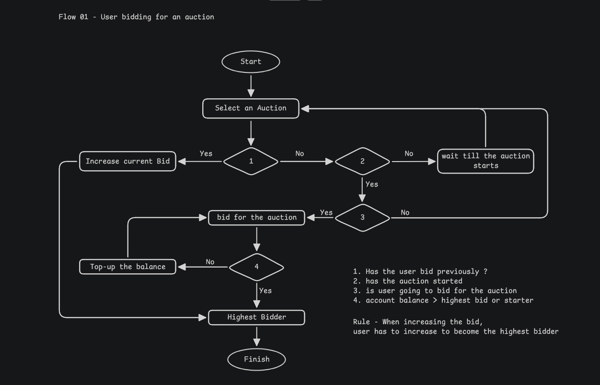
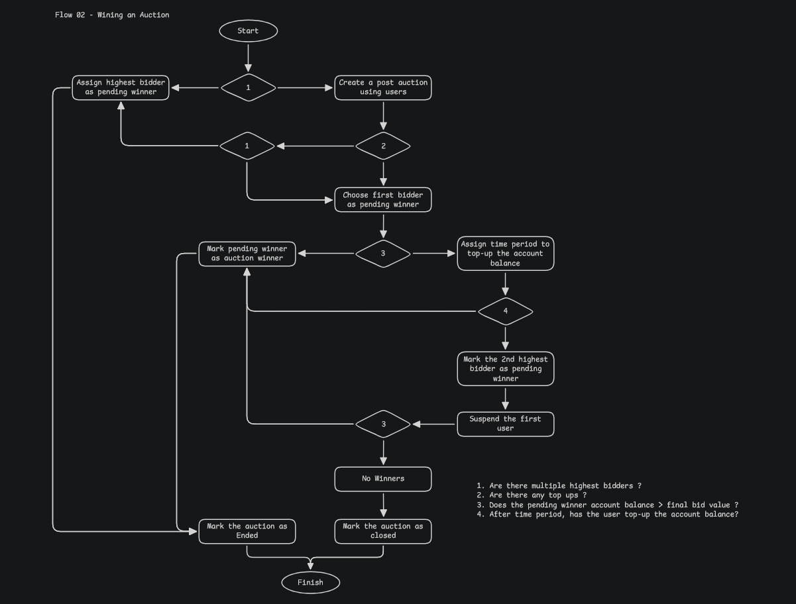

# Cloud Auction Platform - Cloud-Native E-Auction System

A scalable, secure, and highly available cloud-native auction platform demonstrating modern cloud computing principles including microservices architecture, event-driven communication, containerization, and comprehensive monitoring.

---

## Table of Contents
1. [Team Members](#team-members)
2. [Project Overview](#project-overview)
3. [Features Implemented](#features-implemented)
4. [Architecture Overview](#architecture-overview)
5. [Technical Requirements Compliance](#technical-requirements-compliance)
6. [System Architecture Details](#system-architecture-details)
7. [Communication Flow](#communication-flow)
8. [Security Features](#security-features)
9. [Monitoring and Observability](#monitoring-and-observability)
10. [Deployment Information](#deployment-information)
11. [STEPS TO RUN - Quick Start Guide](#steps-to-run---quick-start-guide)
12. [API Documentation](#api-documentation)
13. [Testing](#testing)
14. [Troubleshooting](#troubleshooting)
15. [Project Structure](#project-structure)
16. [Architecture Diagrams](#architecture-diagrams)
17. [Future Enhancements](#future-enhancements)
18. [Links and References](#links-and-references)
19. [Marks Mapping](#marks-mapping)

---

## Team Members

| Name | Registration No |
|------|-----------------|
| Fernando L. N. K. | EG/2021/4510 | 
| Fernando S.A.U. | EG/2021/4511 | 
| Fonseka C. M. | EG/2021/4516 | 
| Rathnaweera P. A. G. N. | EG/2021/4751 |

---

## Project Overview

### What is This System?

The **Cloud Auction Platform** is a real-world cloud-native application that simulates an online auction system where users can:
- **Register and authenticate** using JWT or Google OAuth2
- **Create auctions** for items with start and end times
- **Place bids** on active auctions with automatic highest-bid validation
- **Receive notifications** about bid activities and auction status changes
- **Manage profiles** and view auction history

### Key Objectives

This project demonstrates:
1. **Cloud-native architecture** with microservices design
2. **Scalability** through distributed services and stateless design
3. **High availability** via resilience patterns and fallback mechanisms
4. **Security** through JWT auth, RBAC, and OAuth2 integration
5. **Asynchronous communication** using event-driven patterns
6. **DevOps practices** with Docker, containerization, and IaC (Bicep)
7. **Observability** with Prometheus, Grafana, and distributed tracing

### Academic Context

Module: **EC7204 - Cloud Computing**  

---

## Features Implemented

### User-Facing Features

- ✅ **User Registration**: Sign up with email and password
- ✅ **User Login**: JWT-based authentication with token refresh
- ✅ **Google OAuth2**: Single sign-on via Google
- ✅ **Auction Management**: Create, list, and manage auctions
- ✅ **Bid Placement**: Place bids on active auctions with validation
- ✅ **Bid History**: View all bids placed by a user
- ✅ **Notifications**: Real-time notifications for bid activities
- ✅ **Admin Controls**: Admin-only endpoints for system management
- ✅ **User Status Check**: Verify user account status

### Technical Features

- ✅ **Microservices Architecture**: 5 independent Spring Boot services
- ✅ **JWT Authentication**: Secure token-based auth across all services
- ✅ **OAuth2 Integration**: Google sign-in support
- ✅ **API Gateway**: Centralized routing, validation, rate limiting
- ✅ **Asynchronous Messaging**: RabbitMQ for event publishing
- ✅ **Outbox Pattern**: Transactional outbox for reliable messaging
- ✅ **Service Resilience**: Retry logic, circuit breakers, fallback routes
- ✅ **Rate Limiting**: Redis-backed distributed rate limiting
- ✅ **Request Correlation**: Trace IDs for debugging
- ✅ **Metrics & Monitoring**: Prometheus + Grafana + Zipkin
- ✅ **Docker Containerization**: Multi-stage builds for efficiency
- ✅ **Azure Cloud Deployment**: Bicep templates for IaC
- ✅ **Database Migrations**: Hibernate DDL auto-update
- ✅ **Health Endpoints**: Actuator endpoints for system health

---

## Architecture Overview

### High-Level System Architecture




### Core Components

| Component | Purpose | Version |
|-----------|---------|---------|
| **API Gateway** | Single entry point, auth, rate limiting | Spring Cloud Gateway MVC |
| **User Service** | Registration, login, OAuth2 | Spring Boot, Spring Security |
| **Auction Service** | Auction lifecycle management | Spring Boot, PostgreSQL |
| **Bid Service** | Bid placement, validation | Spring Boot, PostgreSQL, RabbitMQ |
| **Notification Service** | Event consumption, notifications | Spring Boot, PostgreSQL |
| **PostgreSQL** | Primary data store | 16 (Alpine image) |
| **RabbitMQ** | Async messaging | 3-management (Alpine image) |
| **Redis** | Rate limiting, caching | 7 (Alpine image) |
| **Prometheus** | Metrics collection | 2.55.1 |
| **Grafana** | Metrics visualization | 11.5.1 |
| **Zipkin** | Distributed tracing | Optional |

---

## Technical Requirements Compliance

This section directly maps the project to the marking rubric.

### 1. Scalability 

**Design Decisions:**

- **Microservices Architecture**: Each service is independently deployable and scalable
  - No shared state between services
  - Services can be replicated horizontally
  - Load balancer can distribute traffic across service replicas

- **Stateless Services**: All services are stateless
  - Session data stored in JWT tokens
  - Distributed caching via Redis
  - Database handles state persistence

- **Containerization**: Multi-stage Docker builds
  - Each service builds independently
  - Minimal image size (Alpine base)
  - Easy deployment and orchestration

- **Database Optimization**:
  - PostgreSQL with proper indexing
  - Hibernate DDL auto-update for schema management
  - Connection pooling configured

- **Distributed Rate Limiting**:
  - Redis-backed rate limiter
  - Scales across multiple gateway instances
  - Shared state for rate limit counters

**Evidence in Code:**
- Gateway stateless routing configuration
- JWT-based authentication (no session affinity required)
- Redis integration for rate limiting
- Docker Compose with service replication support

### 2. High Availability 

**Design Decisions:**

- **Resilience4j Patterns**:
  - Circuit breakers prevent cascading failures
  - Automatic retries for transient failures
  - Fallback endpoints for service degradation

- **Service Isolation**:
  - Each service has independent database
  - Service failures do not affect other services
  - Fallback controller returns graceful HTTP 503

- **Load Balancing**:
  - Docker Compose load balancing
  - Gateway distributes traffic
  - Azure Container Apps horizontal scaling

- **Health Checks**:
  - Actuator `/actuator/health` endpoints
  - Kubernetes-ready liveness and readiness probes
  - Active health monitoring

**Evidence in Code:**
- Resilience4j configuration in gateway
- Fallback routes for all downstream services
- Health endpoint configuration
- Service-to-service retry logic

### 3. Communication Methods 

**Synchronous Communication:**
- Gateway routes requests to services via REST/HTTP
- Bid service validates auctions via HTTP call to Auction service
- Synchronous request-response pattern with timeout handling

**Asynchronous Communication:**
- RabbitMQ topic exchange for event publishing
- Bid service publishes `BID_PLACED` events
- Notification service consumes events and stores notifications
- Outbox pattern ensures message delivery reliability

**See Communication Flow section below for diagrams.**

### 4. Security Implementation 

**Authentication & Authorization:**
- JWT tokens signed with HS512 algorithm
- Token expiration and refresh mechanism
- Google OAuth2 for alternative login
- Role-based access control (RBAC) with role rules
- Public vs protected endpoint separation

**Gateway-Level Security:**
- JWT validation on all protected endpoints
- Role-based path authorization
- CORS configuration with whitelisted origins
- Request size limits and headers validation
- XSS prevention via security headers

**Data Protection:**
- Password encoding with BCrypt
- Secrets managed via environment variables
- Database credentials never in code
- OAuth2 client secrets encrypted

**See Security Features section below for complete list.**

### 5. DevOps & Deployment

**Containerization:**
- Dockerfile for each service with multi-stage builds
- Docker Compose for local orchestration
- Images pushed to container registry (ACR)
- Alpine base images for minimal footprint

**Infrastructure as Code:**
- Azure Bicep templates for resource provisioning
- Automated deployment scripts (PowerShell)
- Environment variable configuration
- Bootstrap automation for setup

**Deployment Methods:**
- Docker Compose: Local development
- Azure Container Apps: Cloud deployment
- Azure Database for PostgreSQL
- Azure Cache for Redis
- Azure Service Bus (optional)

**See Deployment Information section below.**

### 6. Database Design

**Primary Database: PostgreSQL**
- Relational data model
- Transactions with ACID guarantees
- Separate schemas for each service
- Automatic DDL migration via Hibernate

**Supporting Storage:**
- **Redis**: Rate limiting keys, session cache
- **RabbitMQ**: Event queue for async messaging
- **MongoDB** (optional): Document storage for flexible data

**Schema Design:**
- User table with roles and statuses
- Auction table with status tracking
- Bid table with amount and timestamp
- Notification table with read status
- Outbox table for transactional messaging

---

## System Architecture Details

### API Gateway (Port 8080)

**Purpose**: Central entry point, authentication, routing, resilience

**Key Responsibilities:**
- Route requests to downstream services based on path
- Validate JWT tokens and extract user claims
- Enforce role-based access control
- Apply rate limiting via Redis
- Add request correlation IDs
- Handle retries and circuit breakers
- Return fallback responses on service failures
- Apply CORS policy

**Technologies:**
- Spring Cloud Gateway Server MVC
- Spring Security with JWT
- Resilience4j (circuit breaker, retry, rate limit)
- Redis for distributed rate limiting

**Key Endpoints:**
- `GET /api/users/register` → User Service (public)
- `POST /api/users/login` → User Service (public)
- `GET /api/auctions/**` → Auction Service (protected)
- `POST /api/bids/**` → Bid Service (protected)
- `GET /api/notifications/**` → Notification Service (protected)
- `GET /actuator/health` → Health check (public)
- `GET /actuator/prometheus` → Metrics (public)

### User Service (Port 8081)

**Purpose**: User registration, authentication, profile management

**Key Responsibilities:**
- Register new users with validation
- Authenticate users (email/password)
- Generate JWT tokens
- Refresh expired tokens
- Manage user profiles
- Support Google OAuth2 login
- Track user status (ACTIVE, SUSPENDED, etc.)

**Technologies:**
- Spring Boot 4.0.5
- Spring Security
- Spring Data JPA
- PostgreSQL
- Google OAuth2 Client

**API Endpoints:**
- `POST /api/users/register` - Register new user
- `POST /api/users/login` - Login with email/password
- `POST /api/users/refresh` - Refresh JWT token
- `GET /api/users/status` - Check user account status
- `GET /api/users/{id}` - Get user profile (protected)

**Database:**
- User table (id, email, password, role, status, created_at)
- RefreshToken table (token, user_id, expiry)

### Auction Service (Port 8082)

**Purpose**: Auction lifecycle management

**Key Responsibilities:**
- Create new auctions
- List active/closed auctions
- Update auction status
- Validate auction state for bid placement
- Publish auction events to RabbitMQ
- Store events in outbox table

**Technologies:**
- Spring Boot 4.0.5
- Spring Data JPA
- PostgreSQL
- RabbitMQ (Spring AMQP)
- Jackson for JSON

**API Endpoints:**
- `POST /api/auctions/create` - Create auction (protected, TRUSTED_USER+)
- `GET /api/auctions` - List all auctions (protected)
- `GET /api/auctions/{id}` - Get auction details (protected)
- `PUT /api/auctions/{id}/status` - Update auction status (protected, ADMIN+)
- `GET /api/auctions/status/{status}` - Filter by status (protected)

**Database:**
- Auction table (id, title, description, status, start_time, end_time, created_by_user_id, created_at)
- OutboxEvent table (id, aggregate_id, type, payload, processed, timestamp)

**Auction States:**
- OPENED: Auction created, waiting to start
- IN_PROG: Auction active, accepting bids
- CLOSED: Auction ended

### Bid Service (Port 8083)

**Purpose**: Bid placement and management

**Key Responsibilities:**
- Validate auction state before bid placement
- Check bid amount against current highest bid
- Persist bids to database
- Publish BID_PLACED events to RabbitMQ
- Store events in outbox table
- Retrieve bid history

**Technologies:**
- Spring Boot 4.0.5
- Spring Data JPA
- PostgreSQL
- RabbitMQ (Spring AMQP)
- RestTemplate for HTTP calls to Auction Service
- Jackson for JSON

**API Endpoints:**
- `POST /api/bids/place` - Place a bid (protected)
- `GET /api/bids/auction/{auctionId}` - Get bids for auction (protected)
- `GET /api/bids/user/{userId}` - Get user's bids (protected)

**Database:**
- Bid table (id, auction_id, user_id, user_email, amount, status, placed_at)
- OutboxEvent table (id, aggregate_id, type, payload, processed, timestamp)

**Communication:**
- HTTP GET to Auction Service: `GET /api/auctions/{id}` to validate auction state
- RabbitMQ publish: Sends BID_PLACED event for notification processing

### Notification Service (Port 8085)

**Purpose**: Consume events and manage notifications

**Key Responsibilities:**
- Listen for BID_PLACED events on RabbitMQ
- Create notification records
- Store notifications with read status
- Provide notification retrieval API
- Support notification read/unread marking

**Technologies:**
- Spring Boot 4.0.5
- Spring Data JPA
- PostgreSQL
- RabbitMQ (Spring AMQP)

**API Endpoints:**
- `GET /api/notifications` - List user notifications (protected)
- `GET /api/notifications/unread-count` - Get unread count (protected)
- `PUT /api/notifications/{id}/read` - Mark as read (protected)
- `PUT /api/notifications/read-all` - Mark all as read (protected)

**Database:**
- Notification table (id, user_id, type, message, channel, status, created_at, read_at)

**Event Listener:**
- Listens on `bid.exchange` with routing key `bid.placed`
- Consumes BidPlacedEvent and creates notification records

---

## Communication Flow

### Synchronous Communication

**API Gateway → Downstream Services:**
```
Client Request
    ↓
API Gateway (Port 8080)
    ├─→ [Validate JWT]
    ├─→ [Check RBAC]
    ├─→ [Rate Limit]
    └─→ Route to Service
        ├─→ User Service (8081)
        ├─→ Auction Service (8082)
        ├─→ Bid Service (8083)
        └─→ Notification Service (8085)
```

**Bid Service → Auction Service (HTTP):**
```
Bid Placement Request
    ↓
BidService.placeBid()
    ↓
HTTP GET /api/auctions/{auctionId}
    ↓
AuctionService responds with auction details
    ↓
Validate: Is auction IN_PROG?
    ├─→ YES: Continue with bid placement
    └─→ NO: Return error 400
```

### Asynchronous Communication (Event-Driven)

**RabbitMQ Message Flow:**
```
Bid Service publishes event
    ↓
RabbitMQ Topic Exchange (bid.exchange)
    ├─→ Routing Key: bid.placed
    ├─→ Queue: notifications.queue
    ├─→ DLQ: notifications.dlq (on failure)
    ↓
Notification Service consumes
    ↓
Create Notification record
    ↓
Store in Notification table
```

**Outbox Pattern (Transactional Messaging):**
```
BidService.placeBid()
    ├─→ [TRANSACTION START]
    ├─→ Insert into Bid table
    ├─→ Insert into OutboxEvent table (same transaction)
    ├─→ [TRANSACTION COMMIT]
    ↓
OutboxProcessor polls outbox table
    ↓
Publish to RabbitMQ
    ↓
Mark as processed
```

### Communication Diagram



---

## Security Features

### 1. Authentication

| Feature | Implementation |
|---------|-----------------|
| **JWT Tokens** | HS512 signed, 24-hour expiration |
| **Token Refresh** | Refresh tokens with longer TTL |
| **OAuth2 (Google)** | Google Sign-In integration |
| **Password Encoding** | BCrypt with salt |

### 2. Authorization

| Feature | Implementation |
|---------|-----------------|
| **Role-Based Access Control (RBAC)** | ADMIN, TRUSTED_USER, BASIC_USER roles |
| **Path-Based Rules** | Gateway enforces role rules per endpoint |
| **Protected Routes** | `/api/users/**`, `/api/auctions/**`, etc. |
| **Public Routes** | `/api/users/register`, `/api/users/login`, `/actuator/**` |

### 3. API Gateway Security

| Feature | Implementation |
|---------|-----------------|
| **JWT Validation** | JwtValidationFilter checks all protected requests |
| **CORS Policy** | Whitelisted origins, allowed methods/headers |
| **Rate Limiting** | Redis-backed, 60 req/min per IP |
| **Request Size Limits** | Max HTTP request header 16KB, form post 2MB |
| **Request Correlation** | X-Request-Id header for tracing |

### 4. Data Protection

| Feature | Implementation |
|---------|-----------------|
| **Secrets Management** | Environment variables, no hardcoding |
| **Database Encryption** | PostgreSQL SSL connections (in production) |
| **Input Validation** | Spring validation annotations on DTOs |
| **SQL Injection Prevention** | Parameterized queries via JPA |

### 5. Service-to-Service Security

| Feature | Implementation |
|---------|-----------------|
| **JWT Propagation** | Services validate tokens independently |
| **Internal Service Calls** | HTTP calls include JWT in Authorization header |
| **Timeout Handling** | RestTemplate configured with timeouts |

---

## Monitoring and Observability

### Prometheus Metrics

**Endpoints:**
- Gateway: `http://localhost:8080/actuator/prometheus`
- User Service: `http://localhost:8081/actuator/prometheus`
- Auction Service: `http://localhost:8082/actuator/prometheus`
- Bid Service: `http://localhost:8083/actuator/prometheus`
- Notification Service: `http://localhost:8085/actuator/prometheus`

**Key Metrics Collected:**
- JVM heap/non-heap memory
- HTTP request count, latency, errors
- Database connection pool usage
- RabbitMQ message count
- Custom business metrics (auctions created, bids placed)

### Grafana Dashboards

**Port:** `http://localhost:3000`

**Default Credentials:**
- Username: `admin`
- Password: Set via `GRAFANA_ADMIN_PASSWORD` env var

**Available Dashboards:**
- API Gateway Metrics (request rate, latency, errors)
- Service Health (CPU, memory, uptime)
- Database Performance (query time, connection pool)
- RabbitMQ Status (queue depth, message rate)

**Dashboard Files:**
- `monitoring/grafana/dashboards/grafana-dashboard-api-gateway.json`

### Distributed Tracing (Zipkin)

**Optional Setup:**
- Configure `ZIPKIN_URL` environment variable
- All services configured with W3C trace context propagation
- Request tracing across service boundaries

**Trace Information in Logs:**
```
%5p [${spring.application.name:},%X{traceId:-},%X{spanId:-}]
```

### Health Checks

**Liveness Probe:** `/actuator/health/liveness`  
**Readiness Probe:** `/actuator/health/readiness`

These endpoints return 200 OK when:
- Service is running
- Database is connected
- Redis is accessible (if used)
- RabbitMQ is reachable (if used)

### Log Aggregation

**Log Pattern:**
```
%d{yyyy-MM-dd HH:mm:ss.SSS} %-5level [%thread] %logger{36} requestId=%X{requestId} - %msg%n
```

**Log Levels by Service:**
- Default: INFO
- DEBUG: Available for troubleshooting

---

## Deployment Information

### Local Development (Docker Compose)

**Prerequisites:**
- Docker Desktop installed and running
- Docker Compose v2.0+
- PowerShell (for Windows) or Bash (for Linux/Mac)
- 8GB RAM minimum

**Services Started:**
```
postgres          → localhost:5433
mongodb           → localhost:27017
redis             → localhost:6379
rabbitmq          → localhost:5672, 15672 (UI)
prometheus        → localhost:9090
grafana           → localhost:3000
user-service      → localhost:8081
auction-service   → localhost:8082
bid-service       → localhost:8083
notification-service → localhost:8085
api-gateway       → localhost:8080
```

**Start Command:**
```bash
docker-compose up -d
```

**Stop Command:**
```bash
docker-compose down
```

### Azure Cloud Deployment

**Technology Stack:**
- Azure Container Apps (for services)
- Azure Database for PostgreSQL (managed DB)
- Azure Cache for Redis (distributed caching)
- Azure Container Registry (image registry)
- Azure Service Bus (optional for messaging)
- Azure Monitor + Application Insights (monitoring)

**Infrastructure as Code:**
- **Primary:** `infra/container-apps.bicep`
- **Bootstrap Script:** `bootstrap-azure.ps1`
- **Deployment Script:** `deploy-infra.ps1`

**Bicep Resources:**
- Container App environment
- Container Apps for each service
- PostgreSQL server and database
- Redis cache
- Storage account

**Deployment Steps:**

1. **Prerequisites:**
   ```bash
   # Login to Azure
   az login
   
   # Set subscription
   az account set --subscription <subscription-id>
   ```

2. **Run Bootstrap Script:**
   ```powershell
   .\bootstrap-azure.ps1 -SubscriptionId <id> -ResourceGroup <name>
   ```
   This will prompt for:
   - JWT secret (64-char minimum)
   - PostgreSQL password
   - RabbitMQ credentials
   - Google OAuth credentials
   - Zipkin URL (optional)

3. **Infrastructure is automatically provisioned:**
   - Resource group created
   - Container registry created
   - Bicep template deployed
   - Services deployed to Container Apps
   - Databases initialized

4. **Access the Application:**
   - API Gateway URL: Provided in deployment output
   - Grafana: Available via Azure Monitor

### Environment Variables

**Required for All Services:**
```env
JWT_SECRET=<64-character random string>
JWT_EXPIRATION=86400000  # 24 hours in milliseconds
DB_USERNAME=<postgres-user>
DB_PASSWORD=<postgres-password>
```

**Gateway Specific:**
```env
REDIS_HOST=redis
REDIS_PORT=6379
ALLOWED_ORIGIN_PATTERN=http://localhost:*
```

**Service Specific:**
```env
USER_DB_URL=jdbc:postgresql://postgres:5433/user_db
AUCTION_DB_URL=jdbc:postgresql://postgres:5433/auction_db
BID_DB_URL=jdbc:postgresql://postgres:5433/bid_db
NOTIFICATION_DB_URL=jdbc:postgresql://postgres:5433/notification_db
```

**RabbitMQ:**
```env
RABBITMQ_HOST=rabbitmq
RABBITMQ_PORT=5672
RABBITMQ_USERNAME=guest
RABBITMQ_PASSWORD=guest
```

**OAuth2 (User Service):**
```env
GOOGLE_CLIENT_ID=<client-id-from-google-console>
GOOGLE_CLIENT_SECRET=<client-secret>
APP_OAUTH2_REDIRECT_URI=http://localhost:3000/callback
```

**Monitoring (Optional):**
```env
ZIPKIN_URL=http://zipkin:9411/api/v2/spans
```

---

<a id="steps-to-run---quick-start-guide"></a>
## STEPS TO RUN - QUICK START GUIDE

### Prerequisites

- **Docker Desktop** (including Docker Compose)
- **.NET Core 6+** (for Azure deployment scripts)
- **PowerShell 7+** (for Windows deployment)
- **Git** (to clone the repository)
- **Java 21 JDK** (for local development without Docker)

### Step 1: Clone the Repository

```bash
git clone https://github.com/GiharaNavindu/ec-7204-cloud-project.git
cd auction-platform/ec-7204-cloud-project
```

### Step 2: Set Up Environment Variables

**Copy the example file:**
```bash
cp .env.example .env
```

**Edit `.env` with your values:**
```env
# Secrets
JWT_SECRET=<generate-64-char-random-string>
JWT_EXPIRATION=86400000

# Database
DB_USERNAME=admin
DB_PASSWORD=<set-secure-password>
POSTGRES_USER=admin
POSTGRES_PASSWORD=<same-as-above>

# RabbitMQ
RABBITMQ_USERNAME=guest
RABBITMQ_PASSWORD=guest

# OAuth2
GOOGLE_CLIENT_ID=<get-from-google-console>
GOOGLE_CLIENT_SECRET=<get-from-google-console>

# Monitoring (optional)
GRAFANA_ADMIN_USER=admin
GRAFANA_ADMIN_PASSWORD=<set-password>
```

### Step 3: Build Docker Images (Optional)

```bash
# Build all services
docker-compose build

# Or build specific service
docker-compose build api-gateway
```

### Step 4: Start Services

```bash
# Start all services in background
docker-compose up -d

# View logs
docker-compose logs -f api-gateway

# View specific service logs
docker-compose logs -f bid-service
```

### Alternative Startup on Windows

If you are using Windows, you can also start the application from the project root with:

```powershell
.\run-app.ps1
```


### Step 5: Verify Services Are Running

```bash
# Check all containers
docker-compose ps

# Test API Gateway health
curl http://localhost:8080/actuator/health

# Test authentication endpoint
curl -X POST http://localhost:8080/api/users/login \
  -H "Content-Type: application/json" \
  -d '{"email":"user@example.com","password":"password"}'
```

### Step 6: Initialize Database

**Database tables are created automatically via Hibernate DDL auto-update.**

**Optional: Seed test data**
```bash
# User Service creates sample users (see DatabaseSeeder)
# Accessible after service startup
```

### Step 7: Access Services

**Client-Facing Access (Use These):**

| Interface | URL | Purpose |
|---------|-----|---------|
| API Gateway | `http://localhost:8080` | Single entry point for all application APIs |
| Prometheus | `http://localhost:9090` | Metrics collection and target status |
| Grafana | `http://localhost:3000` | Dashboards and visualization |
| RabbitMQ UI | `http://localhost:15672` | Message broker management UI |

**Internal Service Ports (Development/Debug Only):**

| Service | URL | Notes |
|---------|-----|-------|
| User Service | `http://localhost:8081` | Routed through gateway as `/api/users/**` |
| Auction Service | `http://localhost:8082` | Routed through gateway as `/api/auctions/**` |
| Bid Service | `http://localhost:8083` | Routed through gateway as `/api/bids/**` |
| Notification Service | `http://localhost:8085` | Routed through gateway as `/api/notifications/**` |

### Step 8: Troubleshooting Startup

**Services not starting?**
- Check logs: `docker-compose logs <service-name>`
- Verify ports are free: `netstat -an | grep LISTEN` (Windows) or `lsof -i` (Mac/Linux)
- Ensure .env file is properly set
- Restart services: `docker-compose restart`

---

## API Documentation

All client-facing APIs are exposed through the API Gateway.

**Base URL (Local):** `http://localhost:8080`

**Important:** Use only gateway routes in clients and demos. Direct service ports are internal/development-only.

### Gateway Routing Map (Internal Reference)

| Gateway Path Prefix | Upstream Service |
|---|---|
| `/api/users/**` | user-service |
| `/api/auctions/**` | auction-service |
| `/api/bids/**` | bid-service |
| `/api/notifications/**` | notification-service |

### Authentication APIs (via API Gateway)

#### Register New User
```
POST /api/users/register
Content-Type: application/json

{
  "email": "user@example.com",
  "password": "securepassword123",
  "firstName": "John",
  "lastName": "Doe"
}

Response: 201 Created
{
  "id": 1,
  "email": "user@example.com",
  "firstName": "John",
  "lastName": "Doe",
  "role": "BASIC_USER",
  "status": "ACTIVE"
}
```

#### Login
```
POST /api/users/login
Content-Type: application/json

{
  "email": "user@example.com",
  "password": "securepassword123"
}

Response: 200 OK
{
  "accessToken": "eyJhbGc...",
  "refreshToken": "eyJhbGc...",
  "expiresIn": 86400000,
  "user": {
    "id": 1,
    "email": "user@example.com",
    "role": "BASIC_USER"
  }
}
```

#### Refresh Token
```
POST /api/users/refresh
Content-Type: application/json

{
  "refreshToken": "eyJhbGc..."
}

Response: 200 OK
{
  "accessToken": "eyJhbGc...",
  "expiresIn": 86400000
}
```

#### Check User Status
```
GET /api/users/status
Authorization: Bearer <token>

Response: 200 OK
{
  "userId": 1,
  "email": "user@example.com",
  "status": "ACTIVE",
  "role": "BASIC_USER",
  "lastLoginAt": "2026-04-30T10:30:00Z"
}
```

---

### Auction APIs (via API Gateway)

#### Create Auction
```
POST /api/auctions/create
Authorization: Bearer <token>
Content-Type: application/json

{
  "title": "Vintage Watch",
  "description": "Classic mechanical watch",
  "startTime": "2026-05-01T09:00:00Z",
  "endTime": "2026-05-01T21:00:00Z"
}

Response: 201 Created
{
  "id": 1,
  "title": "Vintage Watch",
  "description": "Classic mechanical watch",
  "status": "OPENED",
  "startTime": "2026-05-01T09:00:00Z",
  "endTime": "2026-05-01T21:00:00Z",
  "createdByUserId": 1,
  "createdAt": "2026-04-30T10:30:00Z"
}
```

#### List All Auctions
```
GET /api/auctions
Authorization: Bearer <token>

Response: 200 OK
[
  {
    "id": 1,
    "title": "Vintage Watch",
    "status": "IN_PROG",
    "startTime": "2026-05-01T09:00:00Z",
    "endTime": "2026-05-01T21:00:00Z",
    "createdByUserId": 1
  }
]
```

#### Get Auction by ID
```
GET /api/auctions/{id}
Authorization: Bearer <token>

Response: 200 OK
{
  "id": 1,
  "title": "Vintage Watch",
  "description": "Classic mechanical watch",
  "status": "IN_PROG",
  "startTime": "2026-05-01T09:00:00Z",
  "endTime": "2026-05-01T21:00:00Z",
  "createdByUserId": 1,
  "createdAt": "2026-04-30T10:30:00Z"
}
```

#### Filter Auctions by Status
```
GET /api/auctions/status/{status}
Authorization: Bearer <token>

Valid statuses: OPENED, IN_PROG, CLOSED

Response: 200 OK
[...]
```

---

### Bid APIs (via API Gateway)

#### Place Bid
```
POST /api/bids/place
Authorization: Bearer <token>
Content-Type: application/json

{
  "auctionId": 1,
  "amount": 150.00
}

Response: 201 Created
{
  "id": 1,
  "auctionId": 1,
  "userId": 2,
  "userEmail": "bidder@example.com",
  "amount": 150.00,
  "status": "ACTIVE",
  "placedAt": "2026-04-30T10:30:00Z"
}

Error: 400 Bad Request (if auction not IN_PROG or bid too low)
{
  "error": "Auction is not open for bidding",
  "status": 400
}
```

#### Get Bids for Auction
```
GET /api/bids/auction/{auctionId}
Authorization: Bearer <token>

Response: 200 OK
[
  {
    "id": 1,
    "auctionId": 1,
    "userId": 2,
    "amount": 150.00,
    "placedAt": "2026-04-30T10:30:00Z"
  },
  {
    "id": 2,
    "auctionId": 1,
    "userId": 3,
    "amount": 160.00,
    "placedAt": "2026-04-30T10:35:00Z"
  }
]
```

#### Get User's Bids
```
GET /api/bids/user/{userId}
Authorization: Bearer <token>

Response: 200 OK
[...]
```

---

### Notification APIs (via API Gateway)

#### Get Notifications
```
GET /api/notifications
Authorization: Bearer <token>
Query Params: page=0, size=20

Response: 200 OK
{
  "content": [
    {
      "id": 1,
      "userId": 2,
      "type": "BID_PLACED",
      "message": "Someone placed a higher bid on your auction",
      "channel": "EMAIL",
      "status": "UNREAD",
      "createdAt": "2026-04-30T10:30:00Z"
    }
  ],
  "pageable": {
    "pageNumber": 0,
    "pageSize": 20,
    "totalPages": 1
  }
}
```

#### Get Unread Count
```
GET /api/notifications/unread-count
Authorization: Bearer <token>

Response: 200 OK
{
  "unreadCount": 3
}
```

#### Mark Notification as Read
```
PUT /api/notifications/{id}/read
Authorization: Bearer <token>

Response: 200 OK
{
  "id": 1,
  "status": "READ",
  "readAt": "2026-04-30T10:35:00Z"
}
```

#### Mark All as Read
```
PUT /api/notifications/read-all
Authorization: Bearer <token>

Response: 200 OK
{
  "totalUpdated": 5
}
```

---

### Health & Monitoring APIs (via API Gateway)

#### Service Health
```
GET /actuator/health
Response: 200 OK
{
  "status": "UP"
}

GET /actuator/health/liveness
Response: 200 OK (service is alive)

GET /actuator/health/readiness
Response: 200 OK (service is ready)
```

#### Prometheus Metrics
```
GET /actuator/prometheus

Response: 200 OK
# TYPE jvm_memory_used_bytes Gauge
jvm_memory_used_bytes{area="heap"} 3294729472.0
...
```

#### Service Info
```
GET /actuator/info
Response: 200 OK
{
  "app": {
    "name": "api-gateway",
    "description": "Cloud Auction API Gateway",
    "version": "0.0.1-SNAPSHOT"
  }
}
```

---

## Testing

### Unit Tests

**Location:** `*/src/test/java/...`

**Technologies:**
- JUnit 5
- Mockito for mocking
- Spring Boot Test

**Run Tests:**
```bash
# All tests
mvn clean test

# Specific service
mvn -f user-service/pom.xml test

# Single test class
mvn test -Dtest=UserServiceTest
```

**Test Coverage:**
- User registration validation
- Token generation and validation
- Auction state transitions
- Bid amount validation
- Authorization checks

### Integration Tests

**Run with Docker Compose:**
```bash
# Start containers
docker-compose up -d

# Run integration tests
mvn verify -DskipTests=false

# Check test results
mvn surefire-report:report
```

### Manual Testing / Smoke Tests

**Test User Registration:**
```bash
curl -X POST http://localhost:8080/api/users/register \
  -H "Content-Type: application/json" \
  -d '{
    "email": "test@example.com",
    "password": "Test1234!",
    "firstName": "Test",
    "lastName": "User"
  }'
```

**Test Login:**
```bash
curl -X POST http://localhost:8080/api/users/login \
  -H "Content-Type: application/json" \
  -d '{
    "email": "test@example.com",
    "password": "Test1234!"
  }'
```

**Test Auction Creation:**
```bash
curl -X POST http://localhost:8080/api/auctions/create \
  -H "Authorization: Bearer <access-token>" \
  -H "Content-Type: application/json" \
  -d '{
    "title": "Test Auction",
    "description": "Test item",
    "startTime": "2026-05-01T09:00:00Z",
    "endTime": "2026-05-02T09:00:00Z"
  }'
```

**Test Bid Placement:**
```bash
curl -X POST http://localhost:8080/api/bids/place \
  -H "Authorization: Bearer <access-token>" \
  -H "Content-Type: application/json" \
  -d '{
    "auctionId": 1,
    "amount": 100.00
  }'
```

### Load Testing

**Using Apache JMeter (optional):**
- Create test plans for concurrent users
- Simulate auction and bid creation
- Measure response times and throughput

**Using Apache Bench:**
```bash
# 1000 requests, 10 concurrent
ab -n 1000 -c 10 http://localhost:8080/actuator/health
```

---

## Troubleshooting

### Common Issues

#### Issue: Port Already in Use

**Problem:** `Address already in use` when starting Docker Compose

**Solutions:**
```bash
# Check what's using port
netstat -ano | findstr :8080  # Windows
lsof -i :8080  # Mac/Linux

# Free the port or change docker-compose port mapping
# Or restart Docker Desktop
```

#### Issue: Database Connection Error

**Problem:** `Cannot connect to database`

**Solutions:**
- Ensure `postgres` service is running: `docker-compose ps`
- Check credentials in `.env` match docker-compose.yml
- Verify database is initialized: `docker-compose logs postgres`
- Restart database: `docker-compose restart postgres`

#### Issue: JWT Token Validation Fails

**Problem:** `401 Unauthorized` on protected routes

**Solutions:**
- Ensure token is included: `Authorization: Bearer <token>`
- Check token hasn't expired (expiration set to 24 hours)
- Verify JWT_SECRET is consistent across services
- Generate new token via login endpoint

#### Issue: RabbitMQ Events Not Processed

**Problem:** Notifications not appearing after bid

**Solutions:**
- Check RabbitMQ service is running: `docker-compose logs rabbitmq`
- Verify exchange/queue created: Access RabbitMQ UI at `localhost:15672`
- Check notification service logs: `docker-compose logs notification-service`
- Verify bid service successfully published: Check `docker-compose logs bid-service`
- Reset queues if needed: `docker-compose down && docker-compose up -d`

#### Issue: Service Won't Start

**Problem:** Container exits immediately

**Solutions:**
```bash
# Check logs
docker-compose logs <service-name>

# Verify image built successfully
docker-compose build <service-name>

# Check for missing environment variables
grep "must be set" docker-compose.yml

# Ensure .env file exists and has required vars
```

#### Issue: Redis Rate Limiting Not Working

**Problem:** Rate limit errors or rate limiting not applied

**Solutions:**
- Verify Redis is running: `docker-compose logs redis`
- Check Redis connectivity: `docker exec -it auction-redis redis-cli ping`
- Verify rate limit is enabled in gateway config
- Check X-Rate-Limit headers in response

#### Issue: Grafana Dashboard Empty

**Problem:** Grafana shows no metrics

**Solutions:**
- Ensure Prometheus is scraping endpoints: Check `http://localhost:9090/targets`
- Verify metrics endpoint accessible: `curl http://localhost:8080/actuator/prometheus`
- Wait 1-2 minutes for data collection
- Check Prometheus data source configuration in Grafana

---

## Project Structure

```
ec-7204-cloud-project/
│
├── api-gateway/                    # API Gateway Service (Port 8080)
│   ├── src/main/java/.../filter/   # JWT, Rate Limit, Correlation filters
│   ├── src/main/java/.../config/   # Gateway configuration, CORS, properties
│   ├── src/main/java/.../controller/ # Fallback controller
│   ├── src/main/resources/application.yml # Gateway config
│   └── Dockerfile                  # Multi-stage Docker build
│
├── user-service/                   # User Service (Port 8081)
│   ├── src/main/java/.../controller/ # Registration, login endpoints
│   ├── src/main/java/.../service/   # User & RefreshToken services
│   ├── src/main/java/.../entity/    # User, RefreshToken entities
│   ├── src/main/java/.../security/  # OAuth2 handler, JWT filter
│   ├── src/main/resources/application.yml
│   └── Dockerfile
│
├── auction-service/                # Auction Service (Port 8082)
│   ├── src/main/java/.../controller/ # Auction endpoints
│   ├── src/main/java/.../service/   # AuctionService, OutboxProcessor
│   ├── src/main/java/.../entity/    # Auction, OutboxEvent entities
│   ├── src/main/java/.../config/    # RabbitMQ configuration
│   ├── src/main/resources/application.yml
│   └── Dockerfile
│
├── bid-service/                    # Bid Service (Port 8083)
│   ├── src/main/java/.../controller/ # Bid endpoints
│   ├── src/main/java/.../service/   # BidService, OutboxProcessor
│   ├── src/main/java/.../entity/    # Bid, OutboxEvent entities
│   ├── src/main/java/.../event/     # BidPlacedEvent class
│   ├── src/main/java/.../config/    # RabbitMQ, RestTemplate config
│   ├── src/main/resources/application.yml
│   └── Dockerfile
│
├── notification-service/           # Notification Service (Port 8085)
│   ├── src/main/java/.../controller/ # Notification endpoints
│   ├── src/main/java/.../service/   # NotificationService
│   ├── src/main/java/.../entity/    # Notification entity
│   ├── src/main/java/.../messaging/ # Event listener
│   ├── src/main/java/.../config/    # RabbitMQ configuration
│   ├── src/main/resources/application.yml
│   └── Dockerfile
│
├── infra/                          # Infrastructure as Code
│   └── container-apps.bicep        # Azure Container Apps deployment
│
├── monitoring/                     # Monitoring & Observability
│   ├── prometheus/
│   │   ├── prometheus.yml          # Scrape configuration
│   │   └── alerts.yml              # Alert rules
│   └── grafana/
│       ├── provisioning/           # Grafana data sources
│       └── dashboards/             # Dashboard JSON files
│
├── docs/                           # Documentation
│   ├── observability/
│   │   └── README.md               # Observability guide
│
├── Screenshots-diagrams/           # Architecture diagrams
│   ├── Architecture/               # User & communication diagrams
│   ├── Diagrams/                   # System, state diagrams
│   └── Flows/                      # Flow diagrams
│
├── docker-compose.yml              # Docker Compose orchestration
├── bootstrap-azure.ps1             # Azure setup script
├── deploy-infra.ps1                # Azure deployment script
├── .env.example                    # Environment variable template
├── init.sql                        # Database initialization script
├── README.md                       # This file
└── pom.xml                         # Parent Maven POM

```

---

## Architecture Diagrams

### 1. High-Level System Architecture


*Shows the overall system with all microservices, databases, and infrastructure components.*

### 2. User State Diagram


*Illustrates user registration, authentication, and status transitions.*

### 3. Auction State Diagram


*Shows auction lifecycle: OPENED → IN_PROG → CLOSED.*

### 4. Bid State Diagram


*Illustrates bid placement, validation, and status management.*

### 5. Lot State Diagram (Alternative)


*Additional state diagram for auction (lot) management.*

### 6. Communication Method


*Depicts synchronous and asynchronous communication patterns between services.*

### 7. Data Flow - Bid Placement


*Detailed flow of bid placement process with service interactions.*

### 8. Data Flow - Notification Processing


*Event flow from bid service through RabbitMQ to notification service.*

---

## Links and References

### Repository
- **GitHub:** [\[GitHub URL\]](https://github.com/GiharaNavindu/ec-7204-cloud-project.git)
- **Main Branch:** `main`
- **Development Branch:** `develop`

### Documentation
- **API Documentation:** See [API Documentation](#api-documentation) section
- **Architecture Guide:** See [Architecture Overview](#architecture-overview) section
- **Deployment Guide:** See [Deployment Information](#deployment-information) section
- **Troubleshooting:** See [Troubleshooting](#troubleshooting) section


### Tools & Technologies
- **Spring Boot:** https://spring.io/projects/spring-boot
- **Docker:** https://www.docker.com/
- **Azure Container Apps:** https://learn.microsoft.com/en-us/azure/container-apps/
- **Prometheus:** https://prometheus.io/
- **Grafana:** https://grafana.com/
- **RabbitMQ:** https://www.rabbitmq.com/


---

## Marks Mapping

This section demonstrates how the project satisfies the marking rubric.

| Rubric Item | Coverage | Evidence |
|------------|----------|----------|
| **Functionality (20%)** | ✅ Complete | User registration, auction creation, bid placement, notifications all functional |
| **Cloud-Native Architecture (20%)** | ✅ Complete | Microservices design, containerized, stateless, event-driven |
| **Scalability & Availability (15%)** | ✅ Complete | Independent services, horizontal scaling, circuit breakers, retries, fallback routes |
| **Security Implementation (10%)** | ✅ Complete | JWT auth, RBAC, OAuth2, rate limiting, input validation, protected routes |
| **DevOps & Deployment (10%)** | ✅ Complete | Docker Compose, Bicep IaC, automated bootstrap, health checks |
| **Communication Methods (10%)** | ✅ Complete | Synchronous HTTP, asynchronous RabbitMQ, outbox pattern |
| **Documentation & Clarity (15%)** | ✅ Complete | Comprehensive README, API docs, architecture diagrams, troubleshooting guide |

### Detailed Compliance Summary

**Functionality:**
- All core features work as expected
- User flows: register → login → create auction → place bid → receive notification
- Admin endpoints for management
- Status checks and health monitoring

**Cloud-Native Architecture:**
- 5 independent microservices
- Each service has its own database
- API Gateway for routing and security
- Docker containerization for all services
- Kubernetes-ready with health probes

**Scalability:**
- Stateless service design allows horizontal scaling
- Redis-backed distributed rate limiting
- RabbitMQ for decoupled async messaging
- Service isolation prevents cascading failures
- Database per service pattern

**High Availability:**
- Resilience4j: Circuit breakers, retries, timeouts
- Fallback endpoints for graceful degradation
- Health checks for automatic recovery
- Distributed caching reduces database load
- Event-driven architecture for system resilience

**Security:**
- JWT authentication with signature validation
- OAuth2 for Google sign-in
- Role-based access control (RBAC)
- Gateway enforces authorization rules
- Secrets managed via environment variables
- Input validation on all endpoints
- Rate limiting prevents abuse

**DevOps & Deployment:**
- Docker Compose for local development
- Multi-stage builds for optimized images
- Bicep Infrastructure as Code for Azure
- Automated setup scripts (PowerShell)
- Health endpoints for liveness/readiness checks
- Prometheus metrics for monitoring

**Communication:**
- Synchronous: Gateway routes to services, Bid validates with Auction via HTTP
- Asynchronous: Bid publishes to RabbitMQ, Notification consumes and stores events
- Outbox pattern ensures message delivery reliability
- W3C trace context for distributed tracing

**Documentation:**
- Comprehensive README with all sections
- API endpoint documentation
- Architecture diagrams and flows
- Quick start guide
- Troubleshooting section
- Clear project structure

---


